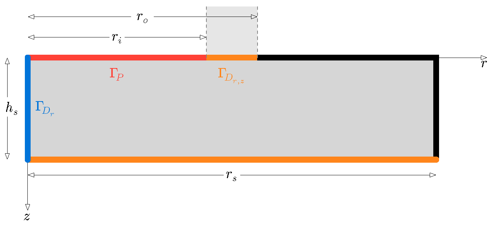

# PipAsp FreeFem++

Axisymmetric harmonic viscoelastic simulation for a pipette aspiration setup, implemented in FreeFem++

## Scope

The script `PipAsp_FreeFem.edp` solves frequency-domain displacement of a 2D axisymmetric specimen under sinusoidal pressure on the pipette inner boundary.

## Model Definition


### Weak frormulation of the PDE
$$
    \int_{\Omega} 2\mu \, \varepsilon(\mathbf{u}) : \varepsilon(\mathbf{v}) + \int_{\Omega} \lambda \, (\nabla \cdot \mathbf{u}) (\nabla \cdot \mathbf{v}) + i\omega \int_{\Omega} 2\eta\, \varepsilon(\mathbf{u}) : \varepsilon(\mathbf{v}) - \int_{\Omega} \rho \, \omega^2 \, \mathbf{u} \cdot \mathbf{v}  
    = \int_{\Gamma_P} (p_0 \cdot \mathbf{n})\cdot  \mathbf{v} 
$$ 
where:
- $\Omega$: axisymmetric simulation domain
- $\mathbf{u} = [u_r,u_z]$: complex displacement field (unknown)
- $\mathbf{v}$: admissible test function
- $\varepsilon(\mathbf{u})$: small-strain tensor of $\mathbf{u}$
- $\mu,\lambda$: Lamé parameters (elastic shear and volumetric stiffness)
- $\eta$: shear viscosity parameter (Kelvin--Voigt viscous contribution)
- $\rho$: mass density
- $\omega = 2\pi f$: angular frequency
- $p_0$: pressure amplitude applied on $\Gamma_P$
- $\Gamma_P$: pressured boundary with $\mathbf{n}$ the outward unit normal on $\Gamma_P$

Term-by-term meaning:
1. $\int_{\Omega} 2\mu\,\varepsilon(\mathbf{u}):\varepsilon(\mathbf{v})$ — elastic shear term 
2. $\int_{\Omega} \lambda\,(\nabla\cdot\mathbf{u})(\nabla\cdot\mathbf{v})$ — elastic volumetric term
3. $i\omega\int_{\Omega} 2\eta\,\varepsilon(\mathbf{u}):\varepsilon(\mathbf{v})$ — viscous damping term
4. $-\int_{\Omega} \rho\,\omega^2\,\mathbf{u}\cdot\mathbf{v}$ — inertial term
5. $\int_{\Gamma_P}(p_0\,\mathbf{n})\cdot\mathbf{v}$ — external virtual work of boundary pressure

### Implementation:
- Unknown field: complex displacement vector `[u1, u2]`
- Formulation: linear viscoelastic harmonic balance with inertia
- Axisymmetric weighting: all weak-form integrals include `2*pi*x`
- Frequency sweep: predefined list from 0 Hz to 750 Hz


## Geometry and Mesh

 

Geometry parameters in SI units:

- `radiusPipetteInner`: $r_i = 1.5\,\text{mm}$ 
- `radiusPipetteOuter`: $r_o = 2.5\,\text{mm}$ 
- `radiusDomain`: $r_s = 50\,\text{mm}$ 
- `heightDomain`: $h_s = 10\,\text{mm}$ 

Discretization controls:

- `nFine = 2.25e4 1/m`
- `nCoarse = 5.0e3 1/m`
- Optional adaptive refinement enabled by `adaptMesh = true`

Boundary labels:

- `1`: pipetteInnerBoundary: pressure boundary
- `2`: pipetteContactBoundary: fixed displacement in r,z-direction 
- `3`: freeBoundaries: traction free
- `4`: bottomBoundary: fixed displacement in r,z-direction 
- `5`: centralLineBoundary: fixed displacement in r-direction 

## Material and Loading Parameters

- `E = 12e3 Pa`
- `nu = 4.90e-1`
- `rho = 1.00e3 kg/m^3`
- `eta = 5.00 P s`
- `pressureBoundary = 25 Pa` (harmonic amplitude)

Derived quantities:

- `mu = E / (2*(1+nu))`
- `lambda = nu*E / ((1+nu)*(1-2*nu))`
- `omega = 2*pi*f`

## Boundary Conditions

- On $\Gamma_{D_{r,z}}$: `pipetteContactBoundary` and `bottomBoundary`:  `u1 = 0`, `u2 = 0`
- On $\Gamma_{D_{r}}$: `centralLineBoundary`: `u1 = 0` (axisymmetry condition)

Applied load:

- On $\Gamma_{D_{P}}$: `pipetteInnerBoundary`: normal pressure `-pressureBoundary` in the `u2` direction

## Outputs

Primary output file:

- `displacement_harmonic.csv`

CSV format:

- Header: `f;ux;uy;p;phase`
- Delimiter: semicolon `;`
- Precision: 12 digits

Column definitions:

- `f`: frequency in Hz
- `ux`: displacement amplitude at `(x0, y0)` in x-direction
- `uy`: displacement amplitude at `(x0, y0)` in y-direction
- `p`: pressure field value at `(x0, y0)`
- `phase`: phase angle of `u2` in radians (`atan2(imag(u2), real(u2))`)

Measurement point (default):

- `x0 = 0.0 m`
- `y0 = 0.0 m`

## Requirements

- Installed [FreeFem++](https://freefem.org/), which is available in PATH as `FreeFem++.exe`. This repository was tested using version 4.15

## Run

From repository root:

```powershell
FreeFem++.exe "PipAsp_FreeFem.edp" -cd
```

`-cd` runs with working directory set to the script directory, so output files are generated in the repository root.

## License

MIT License. See `LICENSE`.
